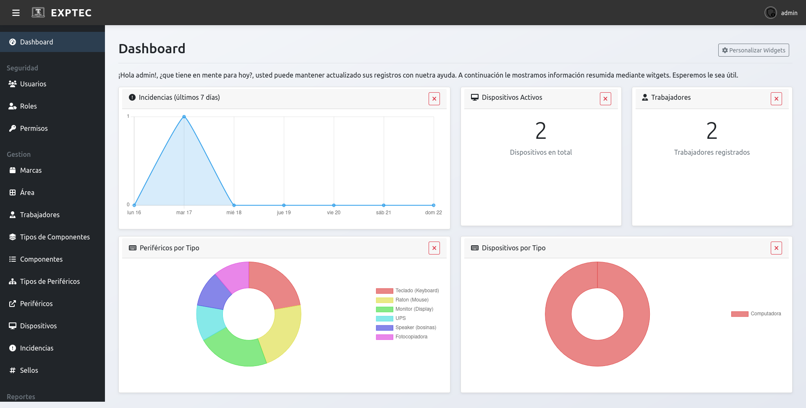

<p align="center" width="100%" style="filter: brightness(2); background: #889;">
  </br>  
</p>


<!-- ALL-CONTRIBUTORS-BADGE:START - Do not remove or modify this section -->
[](#contributors-)
<!-- ALL-CONTRIBUTORS-BADGE:END -->

Exp-tec es una aplicación web para el registro y control de expedientes técnicos de dispositivos, controlando marcas, modelos y números de series, componentes y perifericos. Además un control de sellos de estos dispositivos, acciones y tareas realizadas sobre los dispositivos.

# ScreenShot

## ScreenShot-Login

## ScreenShot-Dashboard


# Requerimientos
- MySQL/MariaDB
- Node.js 18+

# Instalación
1. Descargar el repositorio
```bash
git clone https://github.com/cz9dev/exp_tec.git
cd exp_tec
```

## Configuración incial
1. Copiar el archivo de ejemplo:
```bash
  cp .env.example .env
```
2. Completar los valores en .env con tus valores reales
3. Intalar dependecias:
```bash
  npm install
```
4. Iniciar la aplicación:
```bash
npm start
```

## Poblar DB
Luego debes poblar la DB con los datos iniciales ejecutando el archivo ```/config/seed.js``` (en desarrollo).
```bash
npm /config/seed.js
```

Alternativamente solo debes restaurar la base de datos en mysql o mariadb que se encuentra en el directorio ```/db```

## Uso
Credenciales por defecto al restaurar la base de datos
**usuario: admin**
**password:exptec** 

# Contribuir
Si usted decea constribuir con Exp-tec por favor lea el fichero [CONTRIBUTING.md](CONTRIBUTING.md). Aceptamos todo tipo de constribución, parches, nuevas ideas, reportes de fallos o mejoras, lo que usted crea necesario.

# Contribuciones

<!-- ALL-CONTRIBUTORS-LIST:START - Do not remove or modify this section -->
<!-- prettier-ignore-start -->
<!-- markdownlint-disable -->
<table>
  <tbody>
    <tr>
      <td align="center" valign="top" width="14.28%"><a href="https://cz9dev.github.io/"><br /><sub><b>Carlos Zaldívar</b></sub></a><br /><a href="#code-cz9dev" title="Code">💻</a> <a href="#doc-cz9dev" title="Documentation">📖</a> <a href="#design-cz9dev" title="Design">🎨</a> <a href="#test-cz9dev" title="Tests">⚠️</a> <a href="#maintenance-cz9dev" title="Maintenance">🚧</a></td>
    </tr>
  </tbody>
</table>

<!-- markdownlint-restore -->
<!-- prettier-ignore-end -->

<!-- ALL-CONTRIBUTORS-LIST:END -->

Este proyecto sigue las recomendaciones [all-contributors](https://github.com/all-contributors/all-contributors). ¡Cualquier tipo de contribución es bien recibida!


## Licencia
[Apache 2.0](LICENSE)